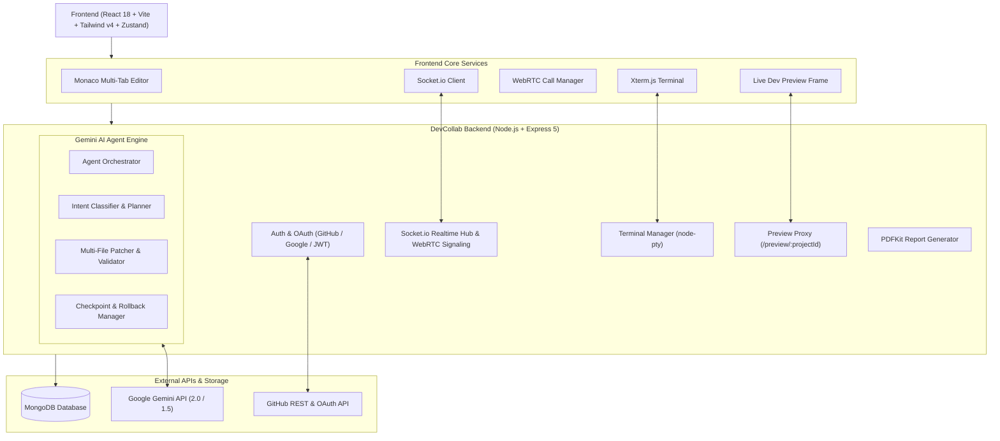

# ⚡ DevCollab — AI-Powered Cloud IDE & Collaborative Engineering Platform

<<<<<<< HEAD
<p align="center">
  
  
  
  
  
  
  
  
</p>
=======


A cutting-edge collaborative development platform that enables teams to seamlessly manage projects, track commits, analyze code quality, and communicate in real-time—all powered by AI-driven insights.

**🔗 Live Demo:** [https://dev-collab-neon.vercel.app)
>>>>>>> 8571b197a3a98f0c2f10388c980b48b5468c5ec6

---

**DevCollab** is an all-in-one cloud development and team collaboration environment. It combines an **in-browser Monaco-based IDE**, **interactive PTY terminals**, **autonomous Google Gemini AI coding agents**, **live preview reverse proxying**, **real-time WebRTC audio/video and chat**, and **deep GitHub Git workflow integration** into a unified developer workspace.

> **🔗 Live Demo:** [https://dev-collab-neon.vercel.app](https://dev-collab-neon.vercel.app) *(or your custom deployment URL)*

---

## 📑 Table of Contents

- [✨ Core Capabilities](#-core-capabilities)
- [🏗️ System Architecture](#️-system-architecture)
- [💻 Cloud IDE & Autonomous Agent Highlights](#-cloud-ide--autonomous-agent-highlights)
- [🛠️ Tech Stack](#️-tech-stack)
- [📁 Project Structure](#-project-structure)
- [📋 Prerequisites](#-prerequisites)
- [🚀 Quickstart & Installation](#-quickstart--installation)
- [🔐 Environment Variables](#-environment-variables)
- [🔌 API Endpoints Reference](#-api-endpoints-reference)
- [🚢 Deployment](#-deployment)
- [🎯 Roadmap](#-roadmap)
- [🤝 Contributing](#-contributing)
- [📄 License & Authors](#-license--authors)

---

## ✨ Core Capabilities

### 1. 🖥️ In-Browser Cloud IDE & File System
- **Monaco Code Editor**: Full multi-tab editing with language support, syntax themes, minimap, formatting, and keybindings.
- **Interactive Terminal**: Virtual pseudoterminal (PTY) powered by `@xterm/xterm` & backend `node-pty` / WebContainers.
- **Live Preview Proxy**: Reverse proxy dev servers inside workspaces and preview web applications with hot reload in real-time.
- **File Tree Management**: Seamless file/folder creation, deletion, renaming, upload, and live sync across team members.
- **Command Palette & Diff Viewer**: Quick navigation (`Ctrl+K` / `Cmd+K`) and side-by-side visual diff modal for reviewing AI and Git changes.

### 2. 🧠 Autonomous Multi-Agent AI (Powered by Google Gemini)
- **Agentic Code Orchestrator**: Multi-step AI agent capable of codebase exploration, planning, and multi-file code editing.
- **Fast-Path & Multi-File Patcher**: Smart diff generation and selective chunk replacements with syntax validation.
- **Checkpointing & Rollback**: Automatic workspace checkpoints before AI executions allowing one-click rollback if needed.
- **Inline AI Assistant**: Inline code completion, automated refactoring, explanation, and unit test generation.
- **Context-Aware Project Q&A**: Gemini agent grounded with full repository context and file dependency graphs.

### 3. 👥 Real-Time Collaboration & WebRTC
- **Workspace Team Channels**: Real-time group messaging with markdown rendering and code snippet highlighting.
- **Peer-to-Peer Audio/Video Calls**: Low-latency WebRTC meetings with screen sharing for remote pair programming.
- **Presence & Activity Tracking**: Live active member status, workspace invitation tokens, and member role management.

### 4. 🔀 Git & Source Control Management
- **Visual Git Workflow**: Stage, unstage, commit, and push repository changes directly from the UI.
- **Interactive Commit Timeline**: Historical commit explorer with detailed author insights and code change diffs.
- **Branch Management**: Create, switch, and inspect repository branches effortlessly.

### 5. 📊 Analytics & Automated PDF Reporting
- **Code Quality & Health Metrics**: Automated repository scanning for code smell detection, optimization, and security issues.
- **PDF Report Generation**: Export rich project health summaries and team contribution metrics via server-side PDFKit and client-side jsPDF.

---

## 🏗️ System Architecture



---

## 🛠️ Tech Stack

### Frontend
- **Framework & Tooling**: [React 18](https://react.dev/), [Vite](https://vitejs.dev/)
- **State Management**: [Zustand](https://github.com/pmndrs/zustand), [TanStack React Query v5](https://tanstack.com/query/latest)
- **Styling & UI**: [Tailwind CSS v4](https://tailwindcss.com/), [DaisyUI 5](https://daisyui.com/), [Framer Motion](https://www.framer.com/motion/), [Lucide React](https://lucide.dev/)
- **Editor & Terminal**: [@monaco-editor/react](https://github.com/suren-atoyan/monaco-react), [@xterm/xterm](https://xtermjs.org/), [@webcontainer/api](https://webcontainers.io/)
- **Realtime & Network**: [Socket.io Client](https://socket.io/), [Axios](https://axios-http.com/)
- **Document & PDF**: [jsPDF](https://github.com/parallax/jsPDF), [html2canvas](https://html2canvas.hertzen.com/), [react-markdown](https://github.com/remarkjs/react-markdown)

### Backend
- **Runtime & Framework**: [Node.js](https://nodejs.org/), [Express.js 5](https://expressjs.com/)
- **Database & ODM**: [MongoDB](https://www.mongodb.com/), [Mongoose 9](https://mongoosejs.com/)
- **AI Engine**: [@google/genai](https://www.npmjs.com/package/@google/genai), [@google/generative-ai](https://www.npmjs.com/package/@google/generative-ai)
- **Realtime & Terminal**: [Socket.io](https://socket.io/), [node-pty](https://github.com/microsoft/node-pty)
- **Security & Auth**: [JSON Web Tokens (JWT)](https://jwt.io/), [bcryptjs](https://github.com/dcodeIO/bcrypt.js), [cookie-parser](https://github.com/expressjs/cookie-parser)
- **Reverse Proxy**: [http-proxy-middleware](https://github.com/chimurai/http-proxy-middleware)
- **Document Generation**: [PDFKit](https://pdfkit.org/)

---

## 📁 Project Structure

```text
DevCollab/
├── Backend/
│   ├── SocketIO/              # Socket.io connection handlers & WebRTC signaling
│   ├── agent/                 # Gemini autonomous agent system
│   │   ├── agent.orchestrator.js   # Multi-turn planning & execution
│   │   ├── agent.classifier.js     # User prompt & task classification
│   │   ├── agent.multi_file.js     # Multi-file patch planner
│   │   ├── agent.patcher.js        # Code diff & AST chunk replacements
│   │   ├── agent.checkpoints.js    # Workspace rollback snapshots
│   │   ├── agent.discovery.js      # Repository index & code context retrieval
│   │   └── agent.tools.js          # Tool declarations for LLM function calling
│   ├── controller/            # Route controllers (Auth, Projects, Workspace, AI)
│   ├── db/                    # MongoDB connection configuration
│   ├── middleware/            # JWT authentication & route security guards
│   ├── model/                 # Mongoose schemas (User, Project, Workspace, Message, etc.)
│   ├── routes/                # Express API & Proxy routes
│   │   ├── previewProxy.js    # Reverse proxy for in-workspace dev servers
│   │   ├── agent.route.js     # AI agent run, stream, and rollback endpoints
│   │   ├── project.route.js   # Workspace file operations, Git sync, terminal
│   │   └── ...                # Auth, Message, Workspace, Report routes
│   ├── services/              # Terminal manager, AI, Workspace FS services
│   ├── server.js              # Express app bootstrap & HTTP/WS server entry
│   └── package.json
│
├── Frontend/
│   ├── src/
│   │   ├── component/         # Reusable UI widgets, Modals, Navbar, Loaders
│   │   ├── context/           # SocketContext & WebRTC call state providers
│   │   ├── hooks/             # Custom React query & mutation hooks
│   │   ├── pages/
│   │   │   ├── Project/
│   │   │   │   └── Workspace/ # Full Cloud IDE implementation
│   │   │   │       ├── DevCollabWorkspace.jsx  # Main IDE Layout
│   │   │   │       ├── MultiTabEditor.jsx      # Monaco Editor Container
│   │   │   │       ├── InteractiveTerminal.jsx # Xterm.js PTY Terminal
│   │   │   │       ├── AIAgentPanel.jsx        # AI Chat & Autonomous Agent UI
│   │   │   │       ├── FileTreeExplorer.jsx    # Explorer & File Tree
│   │   │   │       ├── DiffViewerModal.jsx     # Side-by-Side Diff Inspector
│   │   │   │       └── SourceControlPanel.jsx  # Git UI (Stage/Commit/Push)
│   │   │   ├── Chat/          # Team chat & WebRTC video calling pages
│   │   │   ├── Dashboard/     # Workspace hub & project overview
│   │   │   ├── Report/        # Automated code audit & PDF metrics reports
│   │   │   └── auth/          # Login, Register, GitHub/Google OAuth callbacks
│   │   ├── zustand/           # Global client state stores
│   │   ├── main.jsx           # App entry & TanStack Query client
│   │   └── index.css          # Tailwind CSS v4 stylesheets & themes
│   ├── vite.config.js         # Vite configuration with reverse proxy settings
│   └── package.json
│
└── README.md
```

---

## 📋 Prerequisites

Make sure you have the following installed on your machine:

- **Node.js**: `v18.0.0` or higher
- **npm** or **yarn** / **pnpm**
- **MongoDB**: Local MongoDB instance (`mongodb://localhost:27017`) or cloud [MongoDB Atlas](https://www.mongodb.com/atlas) URI
- **Git**: Installed and available in your system path (required for repository cloning and terminal integration)
- **Google Gemini API Key**: Obtainable from [Google AI Studio](https://aistudio.google.com/)

---

## 🚀 Quickstart & Installation

### 1. Clone the Repository

```bash
git clone https://github.com/hassanMansoor518/DevCollab.git
cd DevCollab
```

### 2. Backend Setup

```bash
# Navigate to the backend directory
cd Backend

# Install dependencies
npm install

# Create environment configuration file
cp .env.example .env # or create .env manually (see table below)

# Start backend server in development mode
npm run dev
```

The backend server will start on **`http://localhost:3001`** (or your specified `PORT`).

### 3. Frontend Setup

Open a new terminal tab/window:

```bash
# Navigate to the frontend directory
cd Frontend

# Install dependencies
npm install

# Create frontend environment configuration
cp .env.example .env # or create .env manually (see table below)

# Start the Vite development server
npm run dev
```

The frontend application will be live at **`http://localhost:4002`**.

---

## 🔐 Environment Variables

### Backend Configuration (`Backend/.env`)

| Variable | Required | Description | Example / Default |
| :--- | :---: | :--- | :--- |
| `PORT` | Yes | Port for Express & Socket.io server | `3001` |
| `DB_URL` | Yes | MongoDB Connection String | `mongodb://127.0.0.1:27017/devcollab` |
| `JWT_SECRET` | Yes | Secret key for signing authentication tokens | `your_super_secret_jwt_key` |
| `GEMINI_API_KEY` | Yes | Google Gemini API Key for autonomous agent & AI | `AIzaSy...` |
| `GITHUB_CLIENT_ID` | Optional | GitHub OAuth App Client ID | `Ov23li...` |
| `GITHUB_CLIENT_SECRET` | Optional | GitHub OAuth App Client Secret | `6b92...` |
| `GITHUB_TOKEN` | Optional | Personal GitHub Access Token for higher rate limits | `ghp_...` |
| `FRONTEND_URL` | Yes | Allowed frontend origin for CORS and cookies | `http://localhost:4002` |
| `CLIENT_URL` | Yes | Client origin for Socket.io and OAuth redirects | `http://localhost:4002` |
| `ALLOWED_ORIGINS` | Optional | Comma-separated list of allowed origins | `http://localhost:4002,http://localhost:5173` |

### Frontend Configuration (`Frontend/.env`)

| Variable | Required | Description | Example / Default |
| :--- | :---: | :--- | :--- |
| `VITE_API_URL` | Optional | Backend URL (leave empty in dev to use Vite proxy) | `http://localhost:3001` |
| `VITE_GITHUB_CLIENT_ID` | Optional | GitHub OAuth App Client ID for frontend button | `Ov23li...` |
| `VITE_GOOGLE_CLIENT_ID` | Optional | Google OAuth Client ID for frontend button | `your_google_client_id.apps.googleusercontent.com` |

---

## 🔌 API Endpoints Reference

### 🔐 Authentication (`/api/auth`)
- `POST /api/auth/register` — Register a new account
- `POST /api/auth/login` — Login with credentials (sets HTTP-only cookie)
- `POST /api/auth/logout` — Invalidate user session
- `POST /api/auth/github` — GitHub OAuth authorization code exchange
- `POST /api/auth/google` — Google OAuth credential exchange

### 🤖 AI Agent & Code Intelligence (`/api/agent` & `/api/ai`)
- `POST /api/agent/stream` — Execute autonomous multi-step agent with streaming events
- `POST /api/agent/fast-path` — Single-file quick edit & refactor
- `POST /api/agent/rollback` — Revert workspace to snapshot checkpoint
- `POST /api/ai/ask` — Context-aware repository question answering
- `POST /api/ai/analyze-code` — Code health scan & refactoring suggestions

### 📁 Project & Cloud IDE Operations (`/api/project`)
- `GET /api/project/:id/files` — Fetch workspace directory tree
- `GET /api/project/:id/file?path=...` — Read specific file content
- `POST /api/project/:id/file` — Save / update file content
- `POST /api/project/:id/create-file` — Create file or directory
- `DELETE /api/project/:id/file` — Delete file or directory
- `POST /api/project/:id/git/commit` — Stage and commit changes to Git
- `POST /api/project/:id/git/push` — Push commits to remote repository

### 🌐 Dev Server Reverse Proxy (`/preview/:projectId` / `/api/project/preview`)
- Maps local in-container dev server ports (e.g. 3000, 5173, 8080) through the backend proxy into the IDE preview pane.

### 👥 Workspaces, Messages & Reports (`/api/workspace`, `/api/message`, `/api/report`)
- `GET /api/workspace` — List user workspaces
- `POST /api/workspace/create` — Create collaborative workspace
- `POST /api/invite/send` — Send workspace invitation token
- `GET /api/report/:projectId/pdf` — Download project analytics PDF report

---

## 🚢 Deployment

### 🌐 Deploy Frontend (Vercel)
1. Push your repository to GitHub.
2. Import the project into [Vercel](https://vercel.app).
3. Set the **Root Directory** to `Frontend`.
4. Configure Build Command: `npm run build`, Output Directory: `dist`.
5. Add Environment Variables:
   - `VITE_API_URL`: Your deployed backend URL (e.g., `https://your-backend.railway.app`)
   - `VITE_GITHUB_CLIENT_ID`: Your GitHub OAuth Client ID

### ⚙️ Deploy Backend (Railway / Render / Heroku)
1. Create a new service pointing to the `Backend` directory.
2. Set the start command: `node server.js`.
3. Set all required environment variables in your hosting provider's dashboard (`DB_URL`, `JWT_SECRET`, `GEMINI_API_KEY`, `FRONTEND_URL`, etc.).
4. Ensure your MongoDB Atlas cluster allows connections from your deployment host (`0.0.0.0/0` or static outbound IPs).

---

## 🎯 Roadmap

- [x] Monaco-based multi-tab cloud IDE with file tree explorer
- [x] Interactive Terminal (xterm.js) and Live Preview Reverse Proxy
- [x] Autonomous Gemini AI Agent with checkpoints and multi-file patching
- [x] WebRTC Audio / Video Calling & Real-Time Workspace Chat
- [x] Git integration, commit history timeline, and diff inspector
- [x] Automated code quality auditing and PDF report export
- [ ] Dockerized isolated sandboxes for backend execution
- [ ] Collaborative multi-cursor live editing (CRDT / Yjs integration)
- [ ] GitLab & Bitbucket VCS integrations
- [ ] Mobile app client (React Native)

---

## 🤝 Contributing

Contributions make the open-source community an amazing place to learn, inspire, and create. Any contributions you make are **greatly appreciated**!

1. **Fork the Project**
2. **Create your Feature Branch** (`git checkout -b feature/AmazingFeature`)
3. **Commit your Changes** (`git commit -m 'feat: Add AmazingFeature'`)
4. **Push to the Branch** (`git push origin feature/AmazingFeature`)
5. **Open a Pull Request**

---

## 📄 License & Authors

Distributed under the **MIT License**. See `LICENSE` for more information.

**Author & Maintainer:**
- **Muhammad Hassan**
  - 📧 Email: [hassanmansoor518@gmail.com](mailto:hassanmansoor518@gmail.com)
  - 💻 GitHub: [@hassanMansoor518](https://github.com/hassanMansoor518)
  - 🔗 LinkedIn: [hassan-mansoor](https://linkedin.com/in/hassan-mansoor)

---

<p align="center">
  <b>⭐ Don't forget to star the repository if you find it helpful! ⭐</b>
</p>
